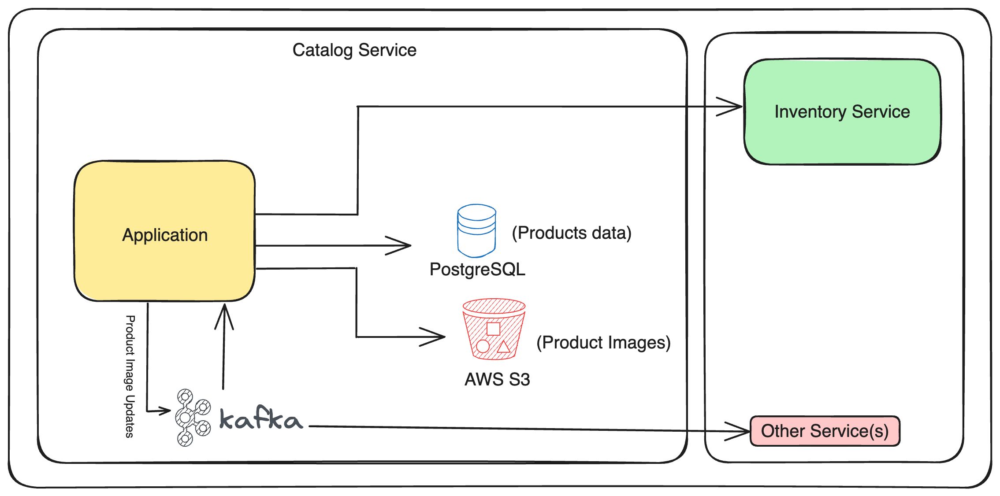

# Step 2: Exploring the app

The application we are going to work is a microservice based on Spring Boot for managing a catalog of products. 
It provides APIs to save and retrieve the product information.

## Storage

### SQL database with the products

When a product is created, we will store the product information in our database.

Our database of choice is PostgreSQL, accessed with Spring Data JPA.

Check `com.testcontainers.catalog.domain.internal.ProductRepository`.

### LocalStack

We would like to store the product images in AWS S3 Object storage.
But we will use [LocalStack](https://localstack.cloud/) to emulate the AWS cloud environment locally during local development and testing with Spring Cloud AWS.

Check `com.testcontainers.catalog.domain.internal.S3FileStorageService`.

### Kafka

When a product image is uploaded to AWS S3, we should publish an event to Kafka.
The kafka event listener will then consume the event and update the product information with the image URL.

Check `com.testcontainers.catalog.domain.internal.ProductEventPublisher` 
and `com.testcontainers.catalog.events.ProductEventListener`.

## API

The API is a Spring Web REST controller \(`com.testcontainers.catalog.api.ProductController`\) and exposes the following endpoints:

* `POST /api/products { "code": ?, "name": ?, "description": ?, "price": ? }` to create a new product
* `GET /api/products/{code}` to get the product information by code
* `POST /api/products/{code}/image?file=IMAGE` to upload the product image

### 
[Next](step-3-local-development-environment.md)